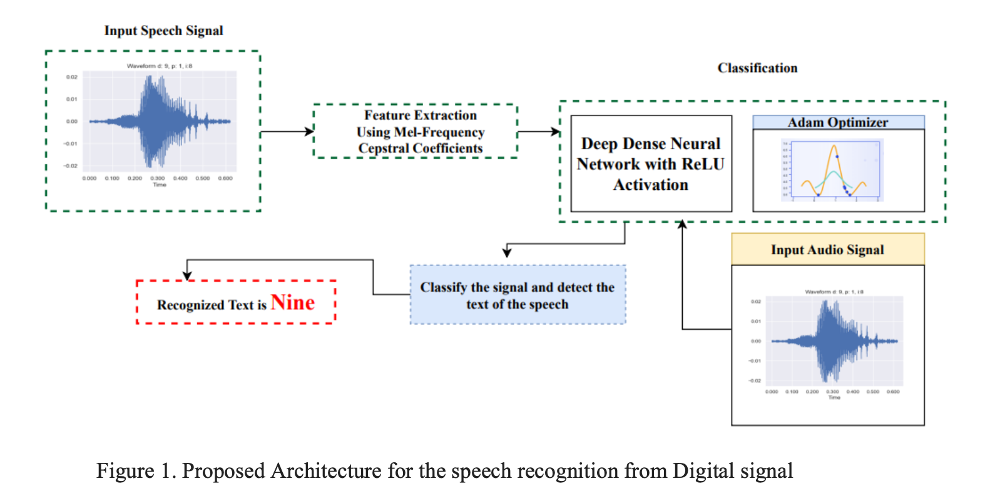
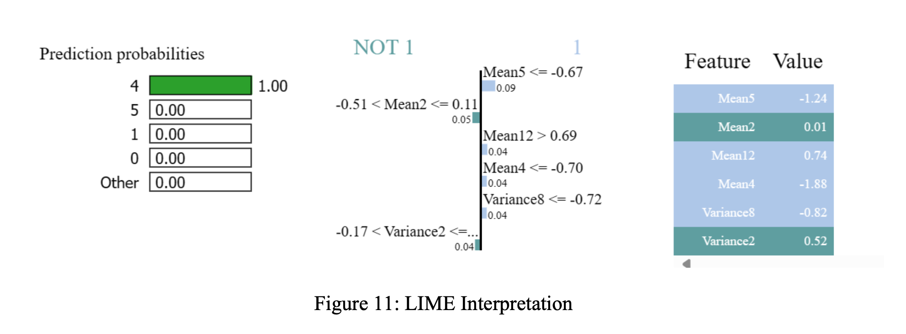

Speech-to-Text Digit Recognition using Deep Dense Neural Network with ReLU Activation

Dataset
AudioMNIST 
- Contains 30,000 audio samples of spoken digits (0–9) by 60 speakers.  
- [Dataset Source (Kaggle)](https://www.kaggle.com/datasets/sripaadsrinivasan/audio-mnist)

Objective
Develop a speech-to-text translation system for digit recognition using a deep learning model, 
specifically a 3-layered Deep Dense Neural Network (DNN) with ReLU activation, 
to accurately classify spoken digits from audio inputs.

Tools & Technologies Used
- Python Libraries: Librosa, NumPy, Matplotlib, Pandas
- Feature Extraction:  
  - MFCC (Mel Frequency Cepstral Coefficients)
- Model Architecture:  
  - Deep Dense Neural Network with ReLU and Softmax
- Explainability:  
  - Local Interpretable Model-Agnostic Explanations (LIME)

Methodology

Data Preprocessing
- Noise removal, resampling, normalization of raw audio.
- MFCC extraction to convert audio into feature vectors (mean & variance).

Model Architecture
- 3-layer Deep Dense Neural Network with:
  - ReLU activation (hidden layers)
  - Softmax (output layer for 10 classes)
- Trained using cross-entropy loss with Adam optimizer.

Explainability
- LIME applied to model predictions to interpret decision logic and enhance transparency.

Performance
- Accuracy : 99.14% on the test set
- Metrics used: Accuracy, Precision, Recall, F1-Score, AUC-ROC, PR-AUC
Visualizations
- MFCCs: Representations for digits 0–9
- Model Output: Accuracy vs. Loss graphs
- Confusion Matrix: Highlights classification strengths and misclassifications
- ROC & Precision Graphs
- LIME Explanations: Feature weights and local interpretability

Skills Demonstrated
- Audio Signal Processing  
- Feature Engineering with MFCC  
- Deep Learning Model Building  
- Explainable AI (XAI) with LIME  
- Evaluation using a wide range of metrics  
- Research Writing and Literature Survey

Conclusion
This project demonstrates a robust pipeline for spoken digit recognition using deep learning. 
The integration of MFCC and a deep dense neural network led to state-of-the-art accuracy, 
while the use of LIME made the model interpretable. 

